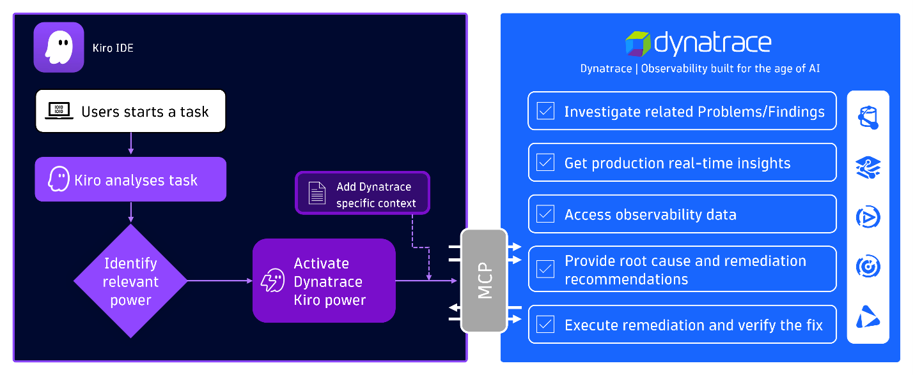

# Dynatrace observability, now a Kiro power

**Authors:** Christian Kiesewetter, Principal Product Manager, GTM, Dynatrace
Shashiraj Jeripotula, Principal Partner Solutions Architect, AWS

## Introduction

[Kiro](https://kiro.dev/) is an AI-powered IDE that helps developers move from idea to working code through spec-driven development and an agentic assistant. To make that assistant genuinely useful in unfamiliar domains, Kiro recently introduced [powers](https://kiro.dev/powers/): curated, partner-validated bundles of MCP servers, steering files, and best practices that install with a single click and load on demand when a relevant task comes up. Install a power, and Kiro's agent gains specialized expertise the moment you need it.

The Dynatrace power for Kiro brings observability into that model. With a single click, the Dynatrace power gives Kiro's agent the tools and context to investigate production behavior and turn that insight into better code. No JSON editing, no manual MCP setup.

For Dynatrace customers already working in Kiro, it's the shortest path yet from code to production insight. For developers new to Dynatrace, it's a one-click way to ground Kiro's reasoning in real facts from your environment, not guesses.

In this blog, we'll introduce the Dynatrace power, show what it unlocks for developers, and walk through how to get it up and running.

## Why this matters for developers

Developers have historically been one step removed from production. When something breaks after deployment, the path to understanding it usually runs through an SRE or operations team — and AI assistants don't automatically fix this. An agent that can write code is still guessing about how that code behaves in production unless it has access to real telemetry.

The Dynatrace power closes that gap. Through [Dynatrace Intelligence](https://www.dynatrace.com/platform/artificial-intelligence/) — the agentic operations system at the core of the platform — Kiro's answers are grounded in deterministic, causal AI and real-time production data, not probabilistic guesses.

*Figure 1. When a developer starts a task, Kiro analyzes it, identifies the Dynatrace power as relevant, and activates it together with its Dynatrace-specific context. From there, the agent can investigate problems, query live observability data, surface root causes, and even execute and verify remediations — all through the MCP connection.*

With the power installed, developers can:

- Investigate live incidents and get root cause analysis directly in the Kiro chat
- Query metrics, logs, and traces from production using natural language
- Surface security vulnerabilities affecting the code they're working on
- Get remediation suggestions grounded in what's actually happening in their environment

> *"Using Kiro powers for Dynatrace has been a total game changer in the observability space. Deep-dive root cause analysis of complex system issues that once required lengthy manual intervention now happens in seconds, giving us unprecedented speed and confidence."*
>
> — Mike Kobush, Sr. Software Performance Engineer, NAIC

## Installing the Dynatrace power

Getting started takes only a few steps. Once installed, the Dynatrace power activates automatically when Kiro detects a relevant task — mention an incident, a slow service, or anything that needs production context, and the Dynatrace tools and steering load into the conversation.

### Prerequisites

- A Dynatrace account. If you don't already have one, you can start a free [15-day trial](https://www.dynatrace.com/signup/).
- [Kiro](https://kiro.dev/) installed on your system.
- Basic familiarity with AWS services and the Dynatrace platform.

### Prepare the Dynatrace connection

First, [create a Dynatrace Platform Token](https://docs.dynatrace.com/docs/manage/identity-access-management/access-tokens-and-oauth-clients/platform-tokens), which Kiro will use to authenticate. Then add the [required permissions for the Dynatrace MCP server](https://docs.dynatrace.com/docs/shortlink/dynatrace-mcp-server).

### Install Dynatrace Kiro power

The Dynatrace power can be installed with one click from either the Kiro IDE or the [Kiro powers website](https://kiro.dev/powers/). For this walkthrough, we'll use the IDE.

1. Launch Kiro IDE.
2. Open the Kiro powers panel by clicking the powers icon.
3. Select **Dynatrace Observability** from the **Recommended** list.
4. Click **Install**. The power is registered with placeholder values for the Dynatrace URL and token, so Kiro will show an error message that the MCP server can't be reached. This is expected — click **Open Settings** to replace the placeholders with your environment details.

### Configure your tenant and token

In the settings file, replace the two placeholders:

- **Replace `YOUR_DT_URL`** with your Dynatrace MCP gateway URL:

  `https://TENANT_ID.apps.dynatrace.com/platform-reserved/mcp-gateway/v0.1/servers/dynatrace-mcp/mcp`

  Replace `TENANT_ID` with your Dynatrace environment ID. You can find it in the URL of your Dynatrace environment — for example, `https://<ENVIRONMENT_ID>.apps.dynatrace.com/ui`.

- **Replace `YOUR_BEARER_TOKEN`** with the Dynatrace platform token you created earlier (for example, `dt0s16.XXXXX`).

### Start asking questions

Open a new chat in Kiro and start interacting with your Dynatrace environment using natural language. Query active problems or security vulnerabilities, request a root cause analysis to identify critical issues in production, or pull related logs and traces — all without leaving the IDE.

### See it in action

The short demo below walks through installing the Dynatrace power, verifying the connection, and running a first query against your environment — in this case, listing the top 10 vulnerabilities Dynatrace has detected.

*[Figure 2 — Installing and using the Dynatrace power for Kiro (video)]*

*Figure 2. Activating the Dynatrace power, verifying the connection, and querying live vulnerability data — all without leaving Kiro.*

## Conclusion

Kiro powers turn what used to be a stitching exercise — MCP servers here, steering files there, custom instructions somewhere else — into a single click. The Dynatrace power applies the same idea to observability: live production insight, causal root cause analysis, and remediation grounded in real telemetry, all available the moment a developer needs them.

The result is a tighter loop between writing code and understanding how it behaves in production. Less waiting on someone else for diagnostic data. Less guesswork from an AI assistant operating without context. More time spent on the work that actually matters.

Ready to try it? [Install the Dynatrace power for Kiro](https://kiro.dev/launch/powers/dynatrace) and start asking your environment questions.
