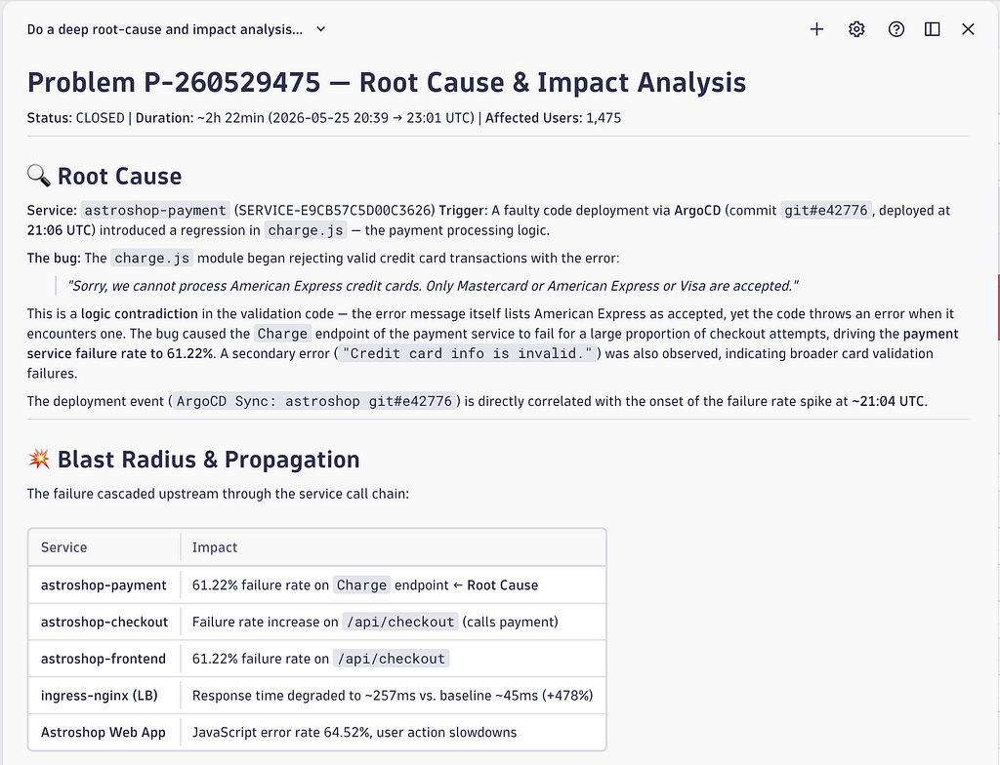
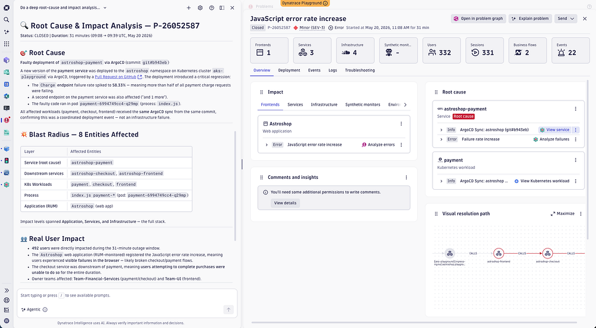
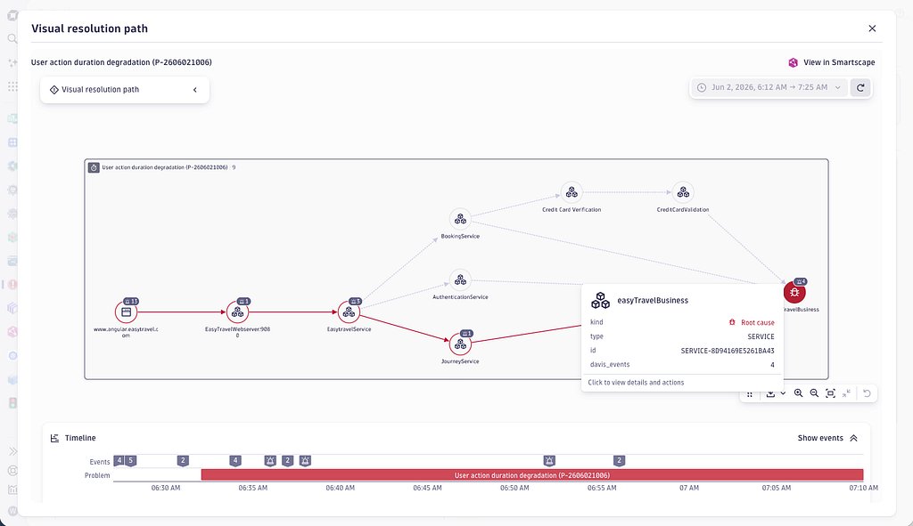
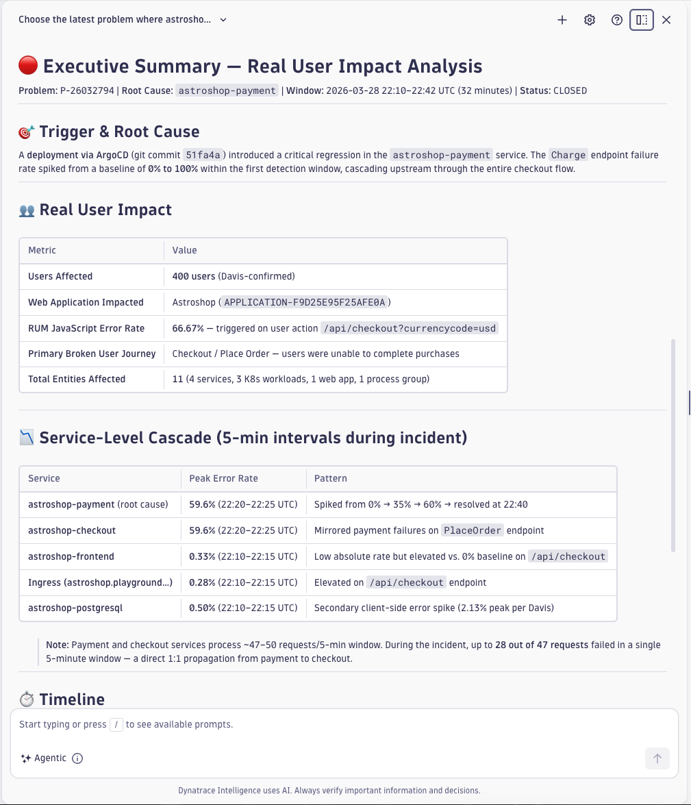
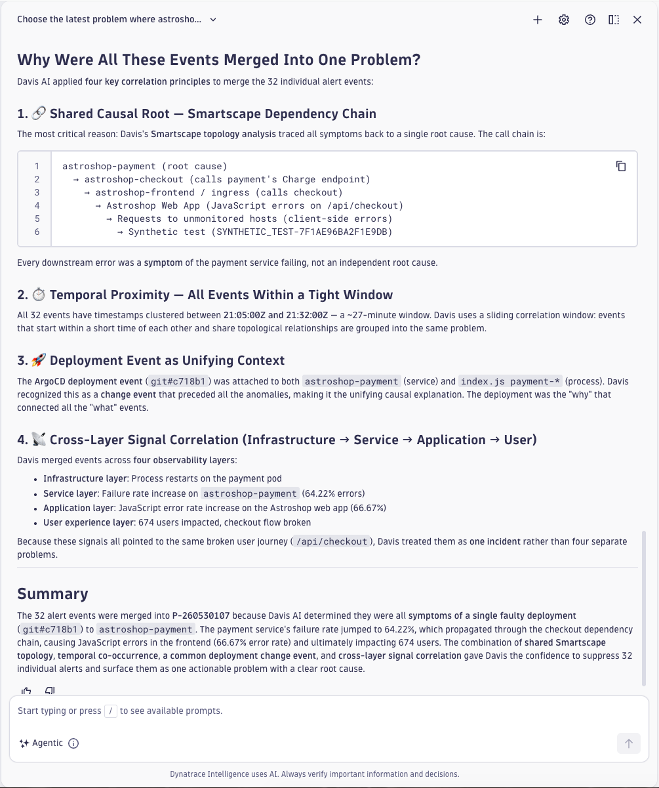
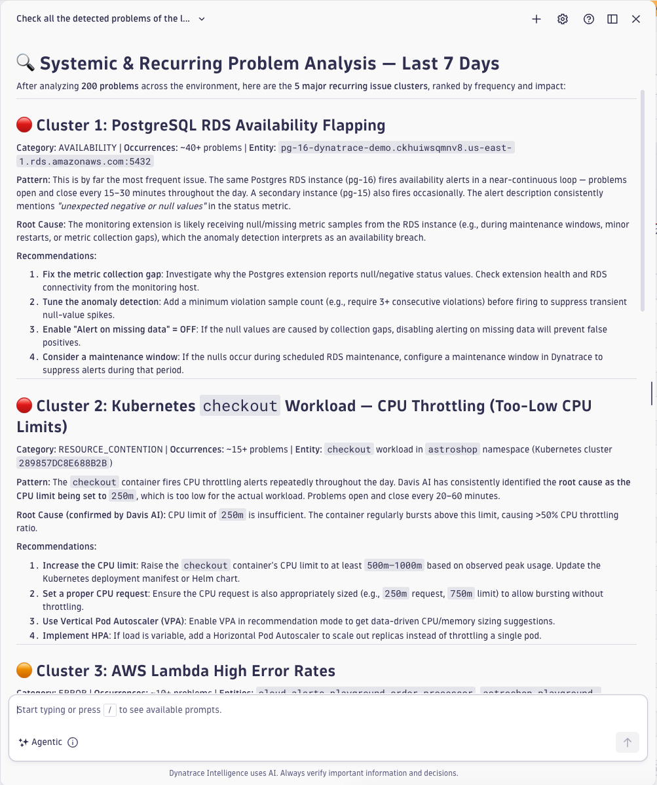
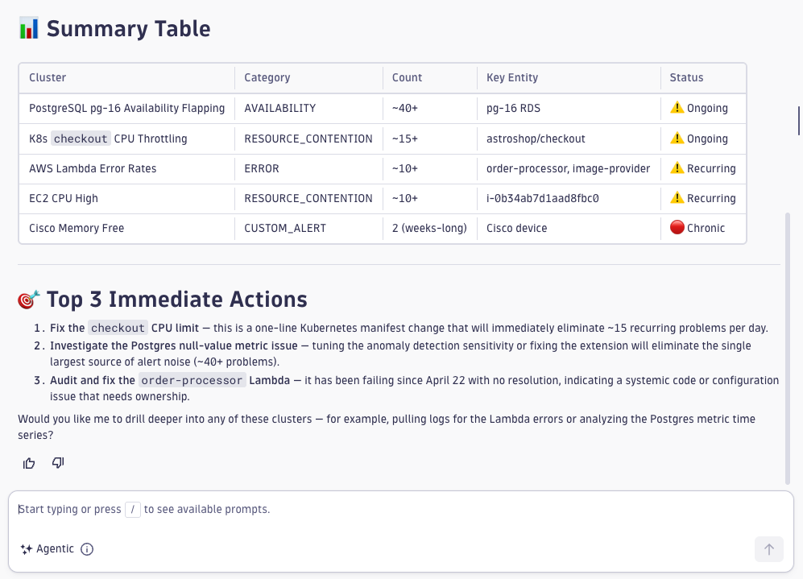

# New Dynatrace Intelligence AI Skill for Root Cause and Impact Analysis

- **Source:** https://medium.com/dynatrace-engineering/new-dynatrace-intelligence-ai-skill-for-root-cause-and-impact-analysis-4bc73595761a
- **Published:** 2026-06-05
- **Tags:** ai, ai-agent-skills, dynatrace-intelligence, incident-response, root-cause-analysis

---

Imagine it’s your on-call shift on a Sunday 2am in the morning. Your phone buzzes and an AI generated voice explains that your attention is required because of a Sev-1 incident just brought down a major software service your department is responsible for.

Fortunately, you are not left alone in analyzing and fixing the incident, as the problem was already detected and analyzed by Dynatrace Intelligence.

Autonomous detection and analysis of large scale production incidents is a fundamental value of any Dynatrace observability environment. Introducing a dedicated Problem Analysis Skill within Dynatrace Intelligence improves detection, denoising of single alerts and surfacing the root-cause and impact reduces mean time to repair (MTTR).

That means that under a highly stressful situation as described above, instead of manually checking problem details for 30 minutes and verifying all the collected details, the Problem Analysis Skill now immediately surfaces that information in 2 minutes.

**Getting this essential information in 2 minutes instead of 30 mins might save your day!**

Within the following examples I will show how Dynatrace Intelligence combines deterministic facts of a realtime world model (Smartscape) with various other facts from the data lakehouse (Grail) using a newly introduced Problem Analysis Skill.

## AI Agents and AI Skills within Observability

Observability is also known as ‘the eyes and ears’ of modern Agentic AI. This means that facts in terms of raw data and topological information that are collected and stored within an observability platform represents the foundation of all AI agents operating on top. Without the proper accuracy, freshness and precision of the observability data, AI agents are running blind, literally.

While AI agents are perfect for surfacing unknown unknowns and to select the right tool within the right situation, they also completely fail with large topological graph structures. Here again, Dynatrace Smartscape acts as the observability context world model for modern agentic AI and delivers facts about the context even in environments with millions of topological nodes and relationships.

Dynatrace’s transition to become the **ultimate, schemaless data lakehouse (Grail)** supports AI Agent operation delivering any data and context at any time with any resolution without any schema or data silo limitations.

AI Agents can leverage **DQL** (Dynatrace Query Language) to combine data queries across logs, traces, metrics, user sessions and business events. The unique characteristics of Grail DQL data queries even **allows AI agents to on-the-fly extract metric values out of unstructured log texts for further analysis**.

AI Skills on the other hand provide the necessary domain knowledge to combine both — all the available observability facts along with the AI model and its harness.

This puts Dynatrace Intelligence in a unique position in serving AI agents with an essential observability harness by providing convenient data analysis tooling (forecast, pattern detection or anomaly detection) to analyze complex incidents, which we will see in the following sections.

## **Introducing the** Problem Analysis Skill

Since their introduction, Anthropic’s AI skills became widely adopted within the Claude community for working with AI agents. Various other vendors such as Microsoft with GitHub CoPilot IDE support the Claude Skill format within their own AI coding IDEs.

> An Anthropic AI “Skill” is a packaged, reusable set of instructions and expertise that teaches the AI how to handle specific tasks. ([ref](https://resources.anthropic.com/hubfs/The-Complete-Guide-to-Building-Skill-for-Claude.pdf))

Essentially an AI skill is giving an already powerful LLM model the right domain knowledge and character to fulfill a dedicated purpose.

Dynatrace early on supported Anthropic and Claude compatible AI skills directly within your Dynatrace tenant or also externally for building your own AI agents (like many of our users do).

Dynatrace transparently publishes important observability AI Agent skills within a dedicated [AI knowledge base GitHub repository](https://github.com/Dynatrace/dynatrace-for-ai).

Clone those Dynatrace AI skills directly into your own AI agent implementation or directly leverage them within your Dynatrace tenant as I will show in the next examples.

Within this post I will focus on the newly introduced Problem Analysis Skill that supports SREs to quickly assess and fix large scale incidents.

## Problem Analysis Skill dives deep into cause and real user impact

Let’s look at the first example use-case where the new **Problem Analysis Skill** helps a user to dive deeper into the cause and impact of any given Dynatrace detected problem. The deterministic problem analysis already denoised multiple alerts into a single problem and used the Smartscape context to identify the closest root-cause topology node. The Problem Analysis Skill now leverages the latest Anthropic models and all the available context to dive much deeper into surfacing unknown unknowns that might have been hidden in log lines, in traces or any other data collected in Grail data lakehouse.

Where the Problem Analysis Skill shines is to look beyond the usual context and to identify some anomalies and unknowns that the deterministic analysis might miss.

See below an example, taken from the Dynatrace Playground where a problem was identified and the Problem Analysis Skill was used to dive deeper into the details to surface even the faulty commit version and also comes up with remediation follow ups.

*Deep agentic AI analysis of root-cause and impact.*

*Root-cause and impact report alongside the detected problem.*

*Causal Smartscape Graph used by the Root-Cause AI Skill.*

This example shows that better Smartscape and Grail context, along with accurate analysis and AI skills, lead to much better results overall.

Try the following Assist prompt yourself within your [**Dynatrace Playground**](https://wkf10640.apps.dynatrace.com/) to replay my example above:

> “Choose the latest problem where astroshop-payment is the root-cause and do a deep root-cause and impact analysis on that problem and summarize the major findings on cause and real user impact in a short summary.”

## Agentic AI Real User Impact Assessment

Automatically assessing and prioritizing detected problems in regards of real user and customer impact is highly critical for estimating their severity. The number of affected users is equally important as checking on business KPIs such as how many checkouts and conversions failed and what percentage of revenue was lost during the incident.

Fixing the highest revenue bleeding incidents first is something the Dynatrace Problem Analysis Skill can immediately support with, as the example below shows.

> Choose the latest problem where astroshop-payment is the root-cause and do a deep real user impact analysis on that problem and summarize the major findings on real user impact in a short, executive summary.

*Problem Analysis Skill generating a real user impact report.*

## Explain Causal Alert Reduction

Denoising and reduction of single alert spam is one of the most important aspects of any modern AIOps systems. Therefore, Dynatrace automatically analyzes all detected single alarms, checks their Smartscape relationships and their timing behavior and groups alarm events that share the same root-cause and impact.

The automatic grouping and denoising of single alarms into problems is a standard feature that all Dynatrace tenants automatically apply.

Understanding why Dynatrace Intelligence grouped some alerts into a single problem and others not is not trivial to understand. While the problem graph shows a visual timeline of all the events and their overlapping timelines, it’s often hard to understand for a human operator to follow the machine reasoning.

The newly introduced Problem Analysis Skill makes it easy to directly ask the AI for a clear explanation on why some alerts merged into a problem while others didn’t.

This helps to understand the reasoning without manually crawling through all the single alert details and enables human or AI operators to refine the decision logic and to adapt selected settings. The goal here is to merge as precise as possible to maximise the denoising ratio to reduce overalerting. In reality, each single alert that was grouped into a single problem means less money and effort spent in analyzing single alerts.

Try the following prompt within Dynatrace Playground to understand the causal reasoning behind the denoising of single alarms.

> Choose the latest problem where astroshop-payment is the root-cause and do a deep analysis on that problem and summarize the major reasons why the single alert events were merged into the problem.

*Explains the causal reason for alert event merges.*

## Expose and Repair Systemic Failures

Reviewing your own environment, you quickly realize that there are a number of systematic issues that appear in regular cadence.

Those systematic, noisy issues tend to grow in number and degrade your alerting efficiency. Also those recurring problems do cost you money as your SRE team either need to spend time filtering them out or even worse, need to analyze and ignore them.

The new Problem Analysis Skill, along with its underlying agentic AI operator is perfect in detecting and analyzing those systemic, recurring problems.

Try the following Dynatrace Assist prompt to find and fix systemic issues:

> Check all the detected problems of the last 7 days and find systemic, recurring issues. Cluster those and give suggestions on how to avoid the continuous detection of those issue clusters.

Within our Dynatrace Playground, Dynatrace Assist correctly identifies multiple, recurring issues, as shown below:

*Dynatrace Problem Analysis Skill identifiying recurring systemic issues.*

Besides identifying systemic, recurring issues, Dynatrace Assist also presents remediation actions that help to avoid such issues going forward and to reduce alert noise overall.

*Dynatrace Intelligence suggesting actions to avoid alert spam by addressing the issues.*

## Problem Analysis Skill Limitations

The depth of the skill’s analysis depends on the completeness of your Smartscape topology and the data retention in Grail. In sparse environments or for very recent services without historical baselines, findings will be less detailed.

Also the current Problem Analysis Skill does not directly support to actively modify Dynatrace tenant settings. This means that the alert spam remediation suggestions that the AI comes up with, the user needs to manually apply.

In Claude Code, the community project [dtctl](https://github.com/dynatrace-oss/dtctl)*, a CLI for Dynatrace automation* can be used to actively change and refine settings and to take action based on the AI suggestions.

## Summary

Within the age of agentic AI, the detection and remediation of issues within your software and infrastructure deployment stack remains one of the most important aspects to reduce downtimes and to avoid cost through overalerting.

The combination of Agentic AI, Problem Analysis Skill and deterministic observability facts offers unique possibilities to improve today’s handling of production incidents.

The newly introduced Dynatrace Problem Analysis Skill adds transparent and powerful expertise to analyze detected problems fast for improving your MTTR.

By leveraging the power of Dynatrace Assist in combination with Anthropic Claude compatible AI skills many use-cases can be implemented nowadays that help to automate the analysis and remediation of problems and to ultimately only alert on situations that are worth to wake up for.

---

[New Dynatrace Intelligence AI Skill for Root Cause and Impact Analysis](https://medium.com/dynatrace-engineering/new-dynatrace-intelligence-ai-skill-for-root-cause-and-impact-analysis-4bc73595761a) was originally published in [Dynatrace Research and Engineering](https://medium.com/dynatrace-engineering) on Medium, where people are continuing the conversation by highlighting and responding to this story.
