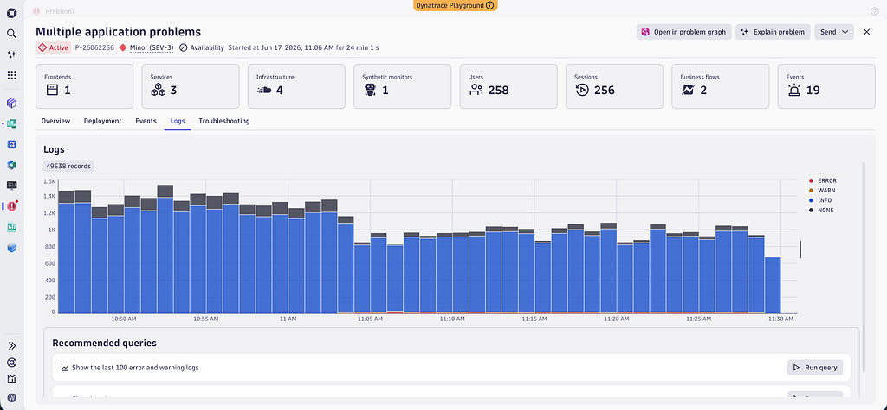
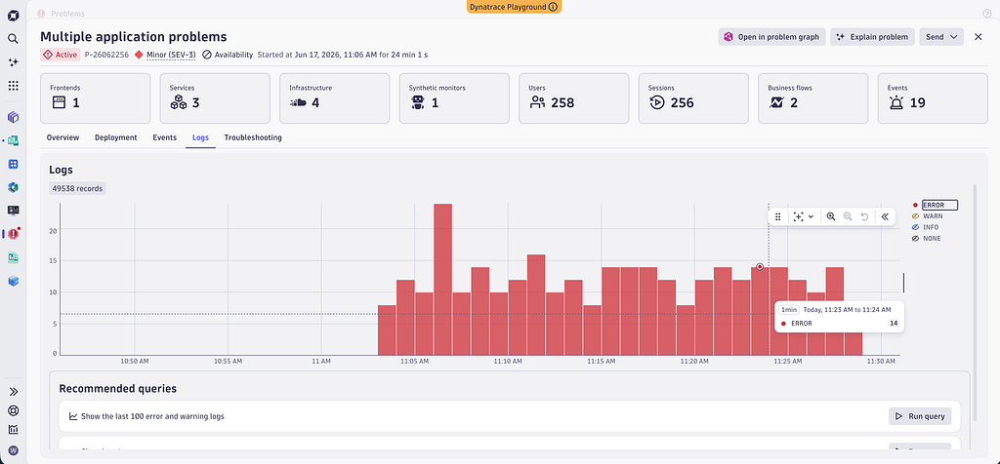
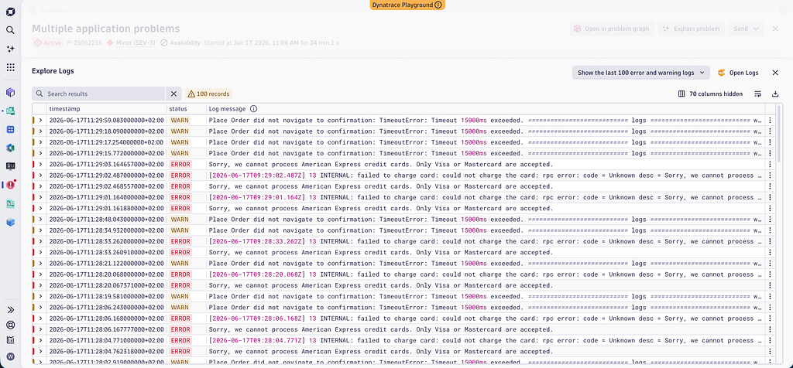
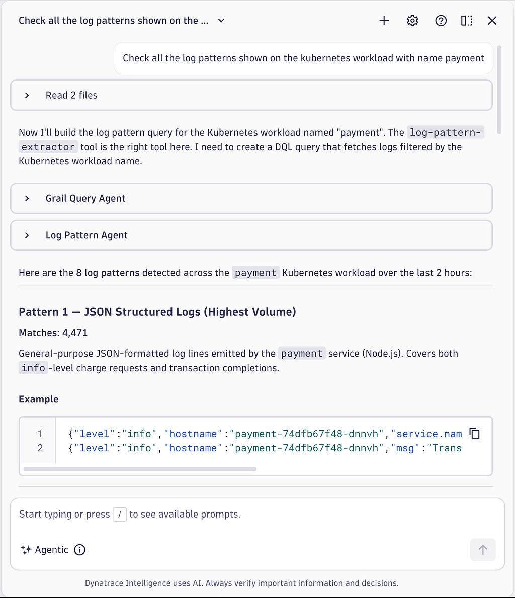
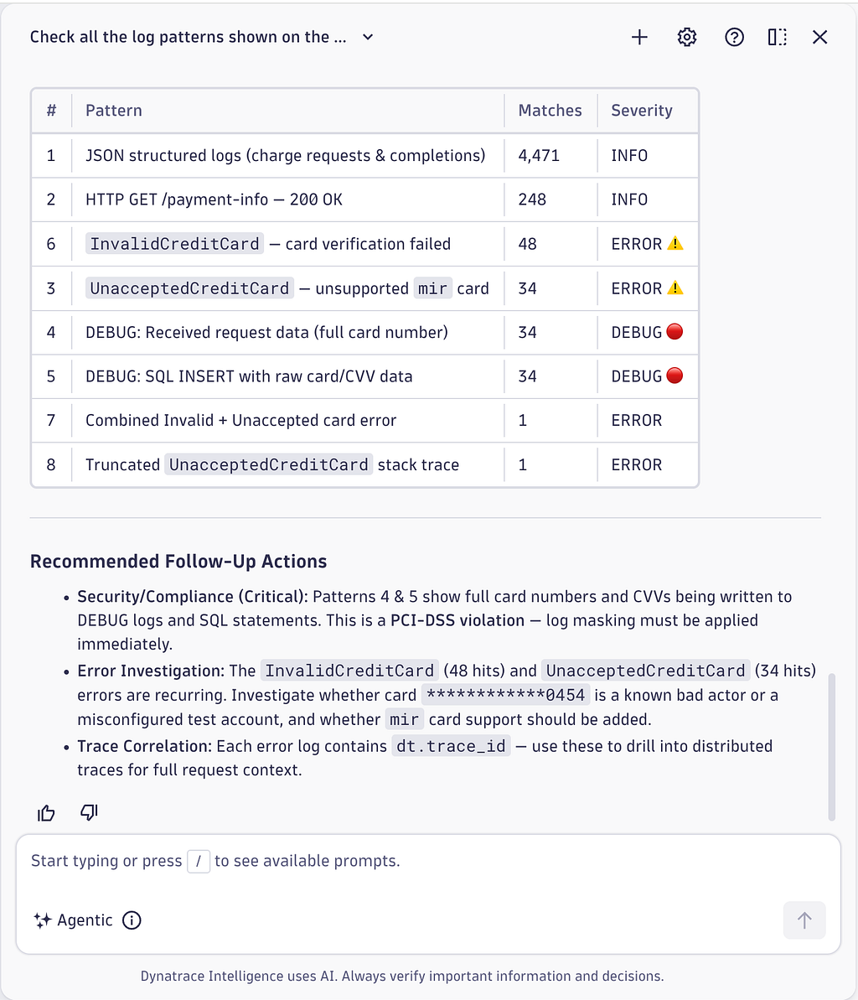
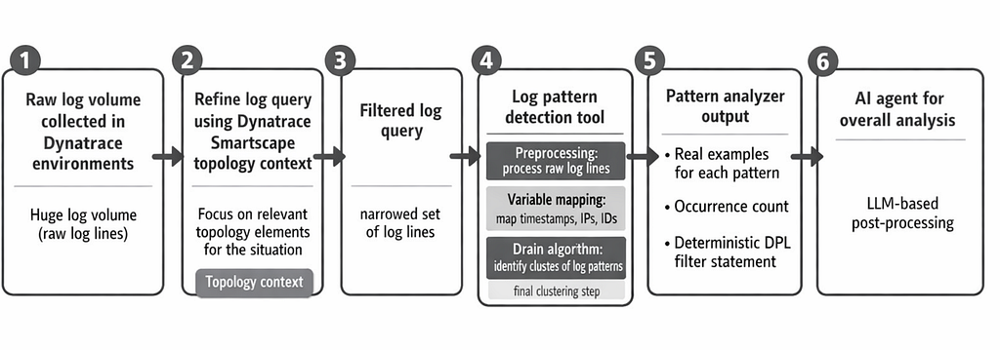

# Better Logs, Smarter AI Agents, Fewer Tokens

- **Source:** https://medium.com/dynatrace-engineering/better-logs-smarter-ai-agents-fewer-tokens-87a822fa0c2a
- **Published:** 2026-06-18
- **Tags:** ai-agent, dynatrace-intelligence, generative-ai-tools, incident-response, logs

---

**How Dynatrace’s intelligent log pattern tool reduces noise before it hits your agents**

## **The Log Volume Challenge**

Last month, I was analyzing a production incident that affected one of my team’s critical services. While the incident was only active for 15 minutes, the correlated problem report already pointed to the root cause — but the affected entities had emitted millions of individual log lines in that window alone.

What immediately hit me was the fact that even the AI-filtered collection of affected entities emitted such a huge number of log lines that it would take me hours to manually investigate.

Using AI agents surely saves me hours of manual work, but it burns through a huge number of input tokens during that process. As an additional negative side effect, several research studies confirmed that AI agents’ accuracy significantly degrades with a growing input context window size, see [Lost in the Middle: How Language Models Use Long Contexts](https://arxiv.org/pdf/2307.03172).

Let’s see how intelligent preprocessing of log content into patterns helps to build smarter AI agents and use fewer LLM tokens overall.

## **What You’ll Learn**

By the end of this post you will know how to:

- process huge amounts of logs in Dynatrace.
- leverage the Dynatrace Log Pattern Analysis tool in agent conversations.
- investigate millions of production incident logs automatically.

## **Logs in Context of Large-Scale Production Incidents**

The amount of log lines that are collected within production software systems is huge. Besides the amount of traces, logs represent the second most voluminous observability data type that companies collect and store.

Unlike metrics and time series of values, which can be stored in a highly compressed and aggregated form, log line content is mostly unstructured or semi-structured text along with a large number of text key-value pairs that are used to further structure the incoming log lines (e.g.: loglevel=ERROR, INFO, WARNING).

While being tremendously spammy at times, log lines also contain crucial information that Site Reliability Engineers and specifically Developers rely on for further debugging and remediating a given incident.

As Large Language Model-based AI agents can perfectly handle unstructured text content, those log lines also represent the gold nuggets for your AI agent context.

A handful of log lines hold exactly the signal an AI agent needs. The rest is noise — and if you feed an agent the raw haystack, the gold gets lost in it.

But let’s see an example of a typical incident and log view within Dynatrace and how an AI agent would process those.


*All 49,538 log records captured during the incident — a mix of ERROR, WARN, INFO, and NONE levels across a 40-minute window.*

Feeding all of these into an AI agent is expensive and counterproductive. Filtering down to just ERROR and WARN already cuts the volume dramatically.


*Same incident view filtered to ERROR logs only — the noise of INFO and NONE records removed.*

Even within the filtered set, each log line carries full message content. Here is what those individual lines look like:


*Log content detail — payment processing timeouts and credit card failures repeated across dozens of lines.*

Now let’s see the full extent of what log lines would contribute in terms of AI agent context size for this single identified problem.

I split the unstructured log content text into individual tokens using the following DQL query:

```
fetch logs| filter status == "ERROR" OR status == "WARN"| fieldsAdd token_count = arraySize(splitString(content, " "))| summarize total_tokens = sum(token_count)
```

In the case of our given problem, all the relevant logs would result in **3,338,980** input tokens overall, and filtered by warning and error level the problem would still account for **22,473** tokens.

Those numbers show that the brute-force processing of log content using AI agents is possible, but it **degrades the agent accuracy and dramatically increases the cost**.

## **Intelligent Log Pattern Preprocessing**

Let’s take a step back and check what the typical log situation looks like and what users would like to discover.

When a user queries the latest log feed, basic statistics lead to a high chance of finding the most frequent log patterns showing up on top.

The chance to accidentally discover a single crash log line within thousands of spammy other log lines is very low. This is one important reason to distinguish between the different log text patterns upfront to be able to **classify a log pattern as being a ‘needle’ or the ‘haystack’**.

This is exactly what the Dynatrace Log Pattern Analysis tool does.

The tool takes a DQL log query and tries to find common patterns within the content text of the found log lines.

As a result, the tool returns the list of patterns, where each pattern shows some real samples, the occurrence count, and the Dynatrace Pattern Language (DPL) pattern that can be used to filter for all samples of that log text pattern in the Dynatrace data lake (Grail).

See the example log pattern tool result below:

```
{  "resultStatus": "SUCCESSFUL",  "output": [    {      "sampleMatches": [        "[2026-06-17 11:07:01,906] INFO    : 172.31.94.70 - - [17/Jun/2026 11:07:01] \"GET /payment-info/8247 HTTP/1.1\" 200 -",        "[2026-06-17 11:07:01,238] DEBUG   : Executing query: SELECT * FROM cards WHERE id = 8247",        "[2026-06-17 11:07:01,851] DEBUG   : Executing query: SELECT * FROM cards WHERE id = 8247"      ],      "patternExpression": "'['TIMESTAMP(yyyy-MM-dd HH:mm:ss):f_0 ',' DATA:f_1",      "numberOfMatches": 248    },  ],  "input": {    "logQuery": "fetch logs, from:now() - 2h\n| filter contains(k8s.workload.name, \"payment\")\n| fields timestamp, content",    "numberOfExamples": 3,    "generalParameters": {      "timeframe": {        "startTime": "2026-06-17T09:10:32.463Z",        "endTime": "2026-06-17T11:10:32.463Z"      },      "logVerbosity": "WARNING",      "resolveDimensionalQueryData": false    }  },  "resultId": "6ce7f73b10b619ef",  "executionStatus": "COMPLETED"}
```

Use the following example prompt within Dynatrace Playground to combine Dynatrace Assist with the Dynatrace Log Pattern Analysis tool:

> ‘Check all the log patterns shown on the Kubernetes workload payment’


*Dynatrace Assist executing the log pattern prompt — the agent calls the log-pattern-extractor tool and returns 8 detected patterns for the payment workload.*


*Log pattern summary table — 8 patterns ranked by match count and severity, with recommended follow-up actions including a PCI-DSS masking violation.*

As a result of the intelligent preprocessing, Dynatrace Assist is able to identify and explain the log patterns without brute-force checking each individual log line. Instead of processing 44,000 tokens of raw log data, the Dynatrace Log Pattern Analysis tool reduces the information to 1,000 tokens. This makes the agent more precise and more efficient in terms of processed tokens.

AI agents can leverage this intelligent log pattern preprocessing for many different use cases, such as:

- ‘Compare yesterday’s log patterns on Kubernetes workload payment with today’s log patterns and identify newly discovered ones’
- ‘Discover abnormal log patterns in context of the latest problem where the root cause was identified as astroshop-payment.’

## **How It Works**

The intelligent filtering of the huge log volume that is collected in Dynatrace environments is achieved by multiple steps.

In an initial step, the log query is refined by using Dynatrace Smartscape topology context to focus on the relevant topology elements that the situation demands.

This filtered log query is handed over to the Dynatrace Log Pattern Analysis tool. The tool processes the raw log lines. Variable parts such as timestamps or IP addresses are automatically mapped, and a Drain algorithm is then used to identify the clusters of log patterns. Drain is an online log parsing approach that uses a fixed-depth parse tree to group raw log messages into clusters efficiently and in a streaming fashion, see [He et al., “Drain: An Online Log Parsing Approach with Fixed Depth Tree,” IEEE ICWS 2017](https://ieeexplore.ieee.org/document/8029742/).

In order to best support post-processing with LLM-based AI agents, the pattern analyzer returns a number of real samples for each pattern along with the occurrence count and the deterministic DPL filter statement.

The array of identified log patterns is then handed over to the AI agent that resumes with the overall analysis. See a schematic visualization of that stepwise log pattern identification process:


*Six-step pipeline: raw log volume → topology-refined query → filtered log set → Drain-based pattern detection → pattern analyzer output (examples, counts, DPL filters) → AI agent for overall analysis*

## **Key Takeaways**

- Dynatrace intelligently identifies log patterns to support AI agents.
- Log pattern detection improves AI agent accuracy and reduces token consumption.
- Log pattern detection is offered through remote Model Context Protocol (MCP).

## **What’s Next**

Identifying log patterns in large volumes of logs to best support AI agent analysis is just the beginning.

Exploding AI token cost and token consumption for big data analysis raises the need for a flexible and dynamic toolbox of data processing tools that are built for AI-first use.

Using AI agents for production-scale observability will only succeed if the processing and analysis cost can keep up with the increase in data volume, whether we look at traces, logs, or metrics.

Using Dynatrace Assist to analyze large volumes of incident logs can save your team valuable minutes during critical incidents and reduces MTTR as you don’t need to manually filter through millions of problem logs.

**Try It Yourself**

The prompts and queries shown in this post work out of the box in the [Dynatrace Playground ](https://www.dynatrace.com/signup/playground/)— a free, no-installation sandbox with real observability data preloaded. Open Dynatrace Assist and start with:

> *”Check all the log patterns shown on the Kubernetes workload payment”*

From there, try comparing yesterday’s patterns with today’s, or scope the analysis to the latest problem in your environment. The Dynatrace Log Pattern Analysis tool is available through Assist and via remote MCP for your own agents — no configuration required in the Playground.

**Resources**

- [Dynatrace Playground](https://www.dynatrace.com/signup/playground/) — free sandbox environment to try the log pattern analysis and Assist prompts shown in this post
- [He et al., “Drain: An Online Log Parsing Approach with Fixed Depth Tree,” IEEE ICWS 2017](https://ieeexplore.ieee.org/document/8029742/) — the foundational paper behind the Drain algorithm used in Dynatrace log pattern detection
- [Liu et al., “Lost in the Middle: How Language Models Use Long Contexts,” 2023](https://arxiv.org/pdf/2307.03172) — research showing AI agent accuracy degrades as the input context window grows

---

[Better logs, smarter AI Agents, fewer tokens](https://medium.com/dynatrace-engineering/better-logs-smarter-ai-agents-fewer-tokens-87a822fa0c2a) was originally published in [Dynatrace Research and Engineering](https://medium.com/dynatrace-engineering) on Medium, where people are continuing the conversation by highlighting and responding to this story.
