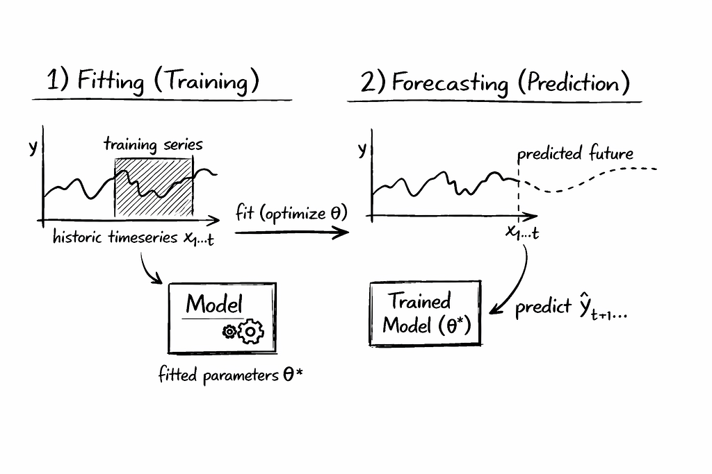
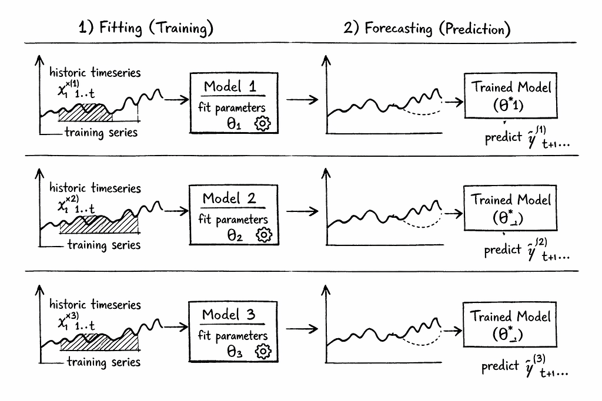
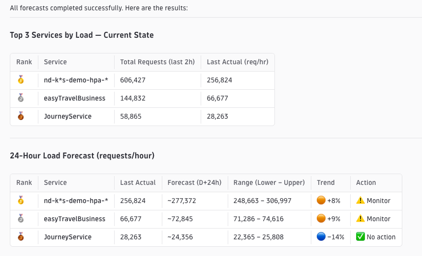
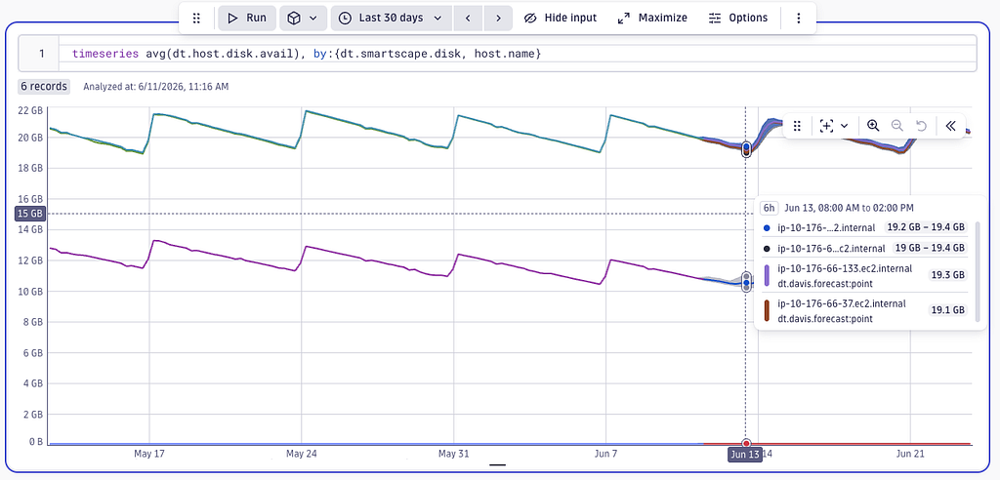
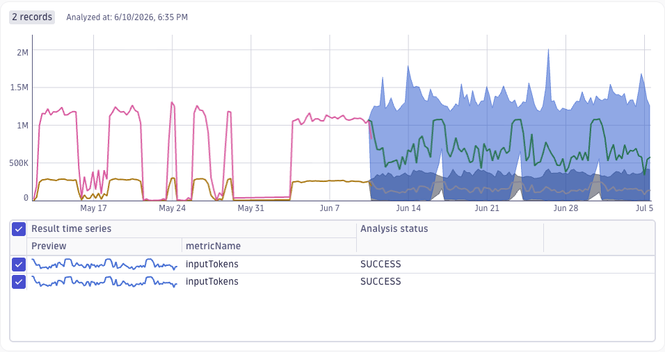
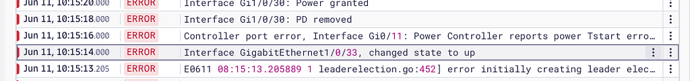
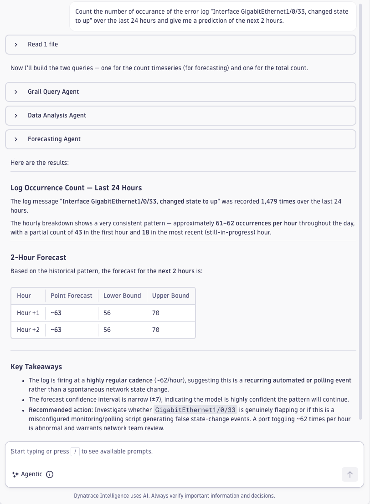
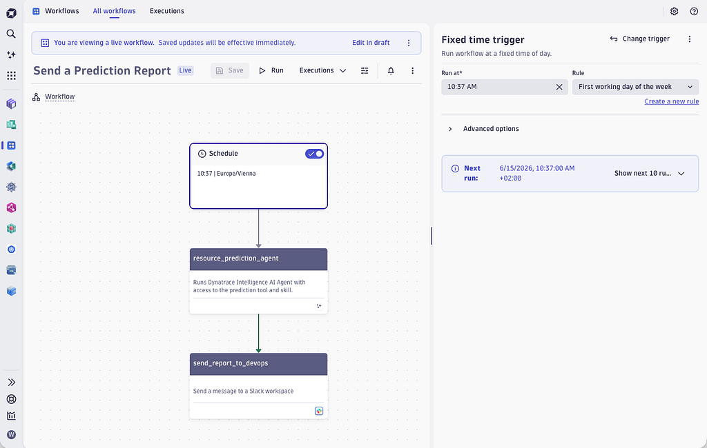

# New Dynatrace AI Skill for Predictive Observability

- **Source:** https://medium.com/dynatrace-engineering/new-dynatrace-ai-skill-for-predictive-observability-39d1b5cc11f7
- **Published:** 2026-07-19
- **Tags:** ai-agent, ai-skills, dynatrace-intelligence, forecasting, machine-learning

---

An alert is throwing you out of your dreams on a Sunday morning because a cloud disk is running full? This seemed to be a topic of the past, especially with the new auto-scaling possibilities in place for all cloud resources, whether cloud disks, compute or network bandwidth.

Knowing upfront that a resource will not meet the demand in the future is a classic challenge of predictive observability, where the SRE team tries to estimate the future demand based on the historic observation.

Training and running a forecast model on top of any kind of observability data always was a job for data scientists and a small group of domain experts.

Dynatrace intelligently combines on-demand model training with the Predictive Analytics Skill to democratize predictive observability for non-data scientists.

## **What is a Prediction Model?**

A prediction model is a machine learning model that has been fitted to historic data. It contains a number of internal parameters, such as weights, coefficients, and thresholds that were gradually adapted to best reflect the observed data in the past.

Think of it as a set of numeric variables that are altered until their combination best fits to the given data in the past. The prediction model then represents a mathematical function that allows you to extrapolate future values based on the fitted parameters. See a schematic for fitting a model to a historic time series and predicting its future values.

*Schematic for fitting a single timeseries prediction model.*

Typically, you do not have a single service or a single workload to predict, but thousands of those. This means you need to fit a thousand independent models, one for each time series, as shown below.

*Schematic of fitting multiple timeseries prediction models.*

Training tens of thousands of individual prediction models is a challenge, due to the huge amount of historic data and the number of time series you would like to predict.

Especially when using GPU-based, billion-parameter prediction models, this quickly proves unusable for real-time processing of predictions.

AI agents without the proper machine learning tools can’t properly handle such a forecast request. Also, the high token costs render GPU-based, transformer-based handling of large-scale predictions impractical.

But don’t worry, Dynatrace does offer powerful prediction tooling in combination with Dynatrace Assist to automatically handle all that for you, which I will showcase in the next sections.

## **Dynatrace Predictive Analytics Skill**

Combining Agentic AI with the most powerful machine learning models democratizes the use of prediction for a much broader group of roles within your organization.

While the machine learning model takes care of the raw data processing of thousands of individual time series, the Predictive Analytics Skill in combination with Dynatrace Assist perfectly translates a user’s natural language question into a plan for training and running a prediction model.

This relieves the user from annoying and error-prone tasks such as:

1. Discovering the necessary observability data.
2. Cleaning and aggregating the training data.
3. Selecting the right prediction model that matches the given data characteristics (seasonal, stationary, noisy, trend, linear, etc.)
4. Setting the right prediction model parameters (e.g.: forecast horizon)
5. Start fitting a model per individual time series.
6. Running the fitted models to give you a prediction for each individual time series for the requested forecast horizon.
7. Finally interpreting and explaining the resulting prediction.

The Dynatrace Predictive Analytics Skill furthermore adds domain knowledge about the dos and don’ts of predicting observability signals into the future.

You can find the new Dynatrace Predictive Analytics Skill within the [Dynatrace AI Knowledge base on GitHub](https://github.com/Dynatrace/dynatrace-for-ai).

If you think about all those necessary steps, it’s even more amazing that Dynatrace Assist can provide all of that within seconds.

Use the following example prompt within the [Dynatrace Playground](https://www.dynatrace.com/signup/playground/) to predict the service load:

> “Identify the top 3 services in terms of load and give me a prediction for their response time in the next 24 hours. Summarize the prediction in a compact table showing the key findings.”

*Predicting the load of the top 3 services with Dynatrace Assist.*

## **Typical Use Cases for Prediction in Observability**

Reading through the Dynatrace community forum and speaking with our users, I came across many different use cases for the application of prediction of observability data.

### **Use Case 1: Predicting your Cloud Disks**

As mentioned in the introduction of this blog, predicting cloud disks is one of the use cases that I came across. It might sound like an outdated story, but many companies still rely on reactive disk alerting, using Sev-4 warning alerts for early heads-up and Sev-3 alerts for urgent reaction times.

Instead of being triggered by hundreds of reactive alerts, you can easily run a prediction report on a regular basis for getting a list of disks that need your attention. As the prediction report can be run during office hours this is much more human-friendly than reactive alerting on Sunday mornings.

*Disk prediction report showing storage capacity forecast.*

### **Use Case 2: Predictive Resource Management**

Beyond predicting disks as a single category of cloud resource, you can generalize the use case towards predictive resource management.

While modern auto-scaling capabilities already handle the reactive parts of resource management, predictive resource management is often used for getting a longer-term outlook report about expected resource demand and costs.

Examples here are to predict the AI Agent token consumption for the upcoming quarter based on the past observed usage.

*Prediction of AI token consumption.*

Predictive resource management is not limited to AI agent token counts, it’s common to also apply it to predict the future load of your services, the typical demand within your frontend web applications, CPU and memory demand for running workloads, network traffic between data centers and cloud regions and many more.

### **Use Case 3: Predicting Event Occurrences**

Another prominent ask for prediction is to learn the typical behavior of events, such as number of deployments, number of alarms or number of failed user login events.

The purpose here is to identify behavior that is outside the predicted band and that most likely represents an abnormal or even malicious situation you should look at.

As Dynatrace Grail uses a unifying data lakehouse, it’s equally possible to filter, aggregate, and summarize any event or log line pattern and to use the Predictive Analytics Skill for predicting the pattern into the future.

Try the following example prompt within the [Dynatrace Playground](https://www.dynatrace.com/signup/playground/):

> “Count the number of occurrences of the error log ‘Interface GigabitEthernet1/0/33, changed state to up’ over the last 24 hours and give me a prediction of the next 2 hours.”

*Log line pattern used for prediction.*

Dynatrace Assist will automatically query the requested log pattern, summarize the occurrence count as a time series, and trigger the training of a prediction model that allows the agent to give you an estimate of the expected number of such log events in the next 2 hours, as shown below:

*Predicting log pattern occurrences.*

## **What are the Limitations of Prediction Models?**

Fitting prediction models follows standard statistical rules, which means it can’t predict magic results out of thin air.

A data science rule of thumb is that you need stable training data of at least 2 times the forecast horizon. If you want to predict a day into the future, you at least should select 2 days of stable training data. Predicting a day into the future by just having observed the situation a single hour does not make much sense.

In case you want to fit on seasonal behavior, like daily and weekly patterns, which are typical for classic business-hour human behavior, you must use a training period that is 2 times larger than the expected periodic pattern. Identifying a weekly pattern at least needs 2 weeks of stable observations.

The beauty of the newly released Dynatrace Predictive Analytics Skill is that it already has those basics baked into it, so you don’t have to worry about those.

## **Automate the Prediction**

Running predictions on demand is useful. Running them on a schedule — and routing the results to Slack before anyone opens a ticket — is where the real value is.

Examples here could be to regularly get a resource prediction report sent into your DevOps Slack channel, or to alert you proactively when a resource shortage is expected.

All those use cases you can implement by leveraging Dynatrace Workflows, as it is shown in the screenshot below:

*Prediction workflow with Dynatrace Agent.*

Dynatrace Workflow automation allows you to directly automate on top of the Dynatrace data lakehouse. It seamlessly integrates the permission policies, so that you have a fine-grained access policy in place that allows you to limit the AI agent’s access to raw observability data to the minimum required.

Workflows can be triggered upon a regular schedule or based on events within the Dynatrace environments, such as detected problems or SLO violations.

Workflows are flexible in the sense that you can also run JavaScript custom code sections to further adapt the automation flow and to better integrate into your own system environment.

## **Summary**

Three months ago, predicting AI token consumption for a quarter required a data scientist and a Jupyter notebook. Now it’s a single prompt.

A network engineer, a finance analyst, and an SRE can all run a prediction report with the same natural language prompt — no DQL, no Python, no model selection required.

The examples given show some practical use cases on how to apply predictive observability and how to gain value out of the combination of transformer-based AI agents with statistical machine learning models.

That Sunday morning alert becomes a Friday afternoon report — generated automatically, before the disk ever fills.

Try the Predictive Analytics Skill yourself in the [Dynatrace Playground](https://www.dynatrace.com/signup/playground).

---

[New Dynatrace AI Skill for Predictive Observability](https://medium.com/dynatrace-engineering/new-dynatrace-ai-skill-for-predictive-observability-39d1b5cc11f7) was originally published in [Dynatrace Research and Engineering](https://medium.com/dynatrace-engineering) on Medium, where people are continuing the conversation by highlighting and responding to this story.
