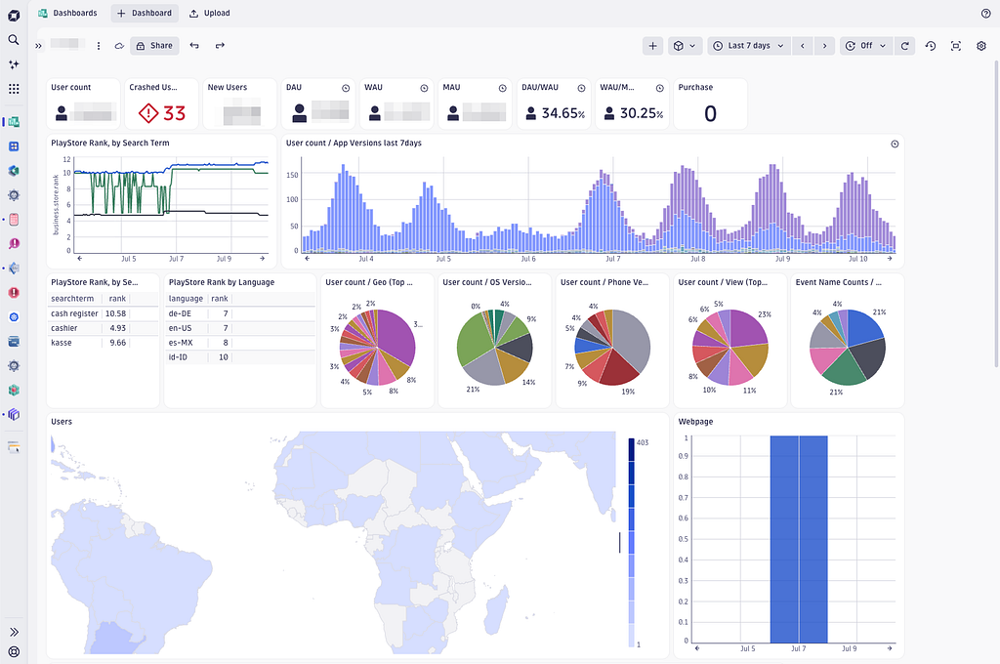
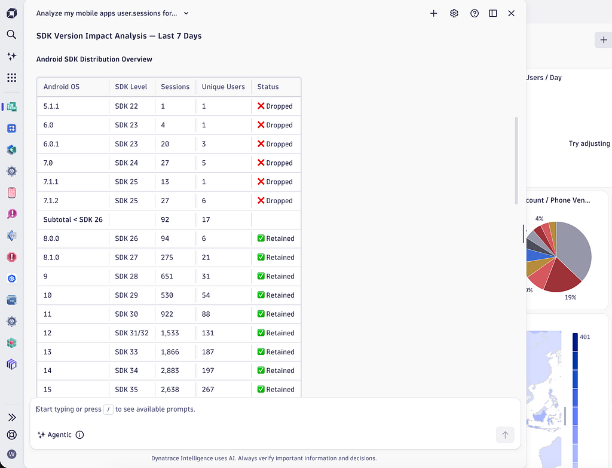
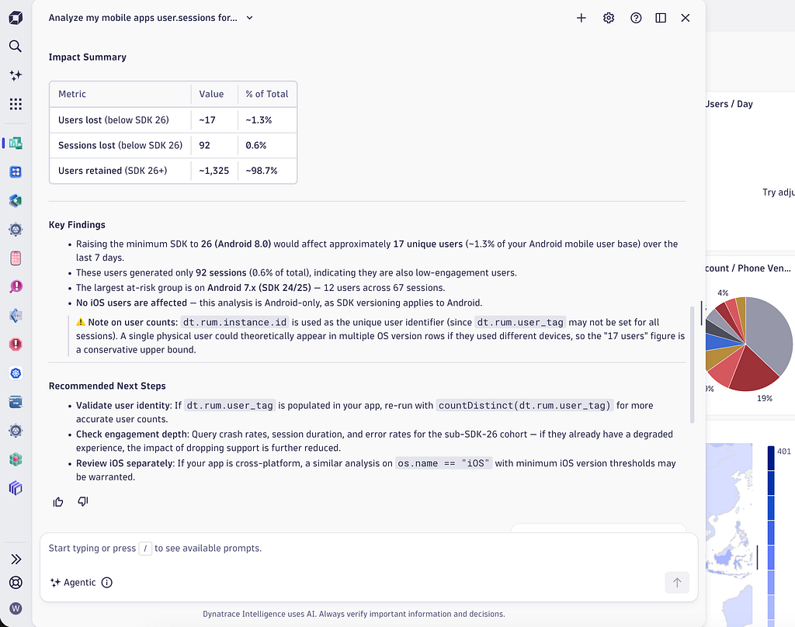
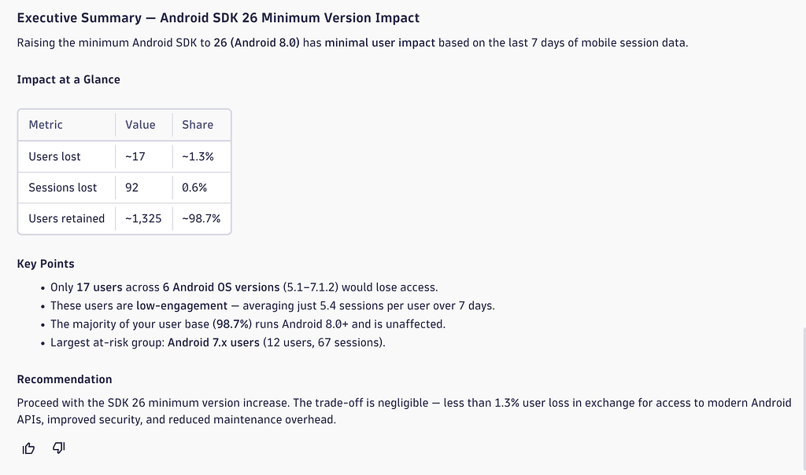
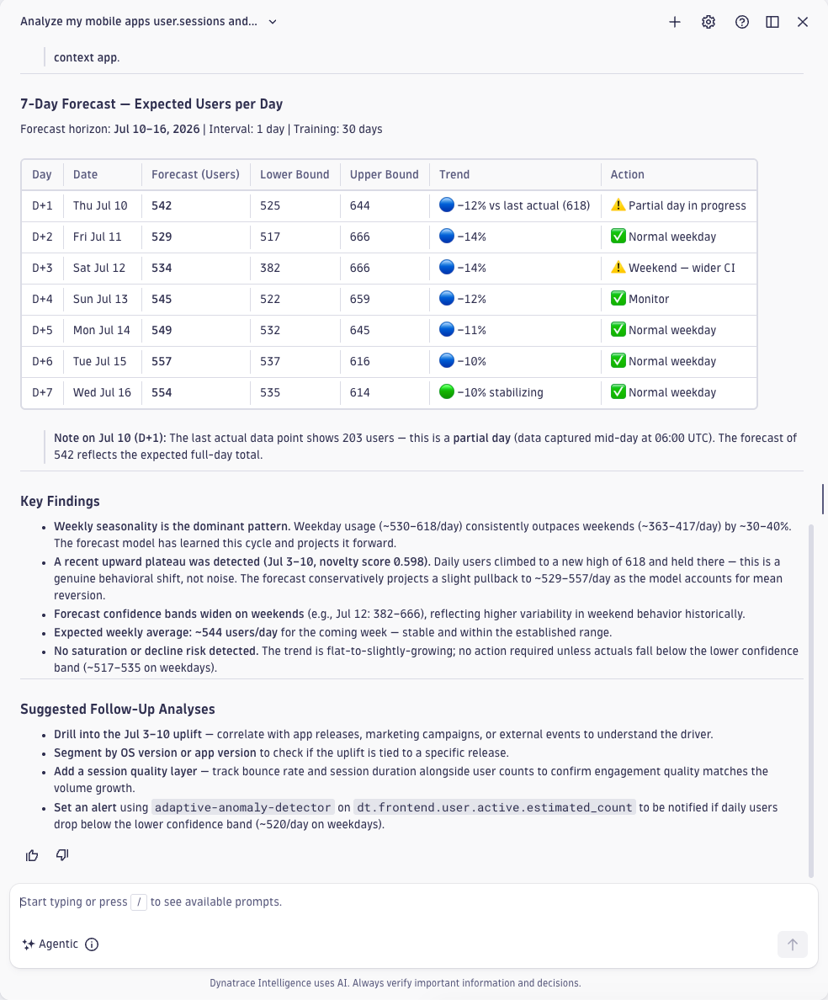
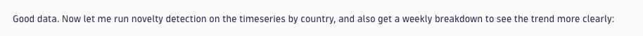
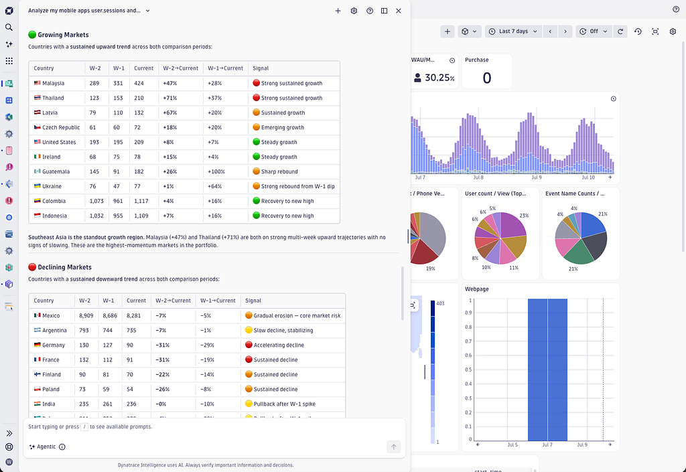
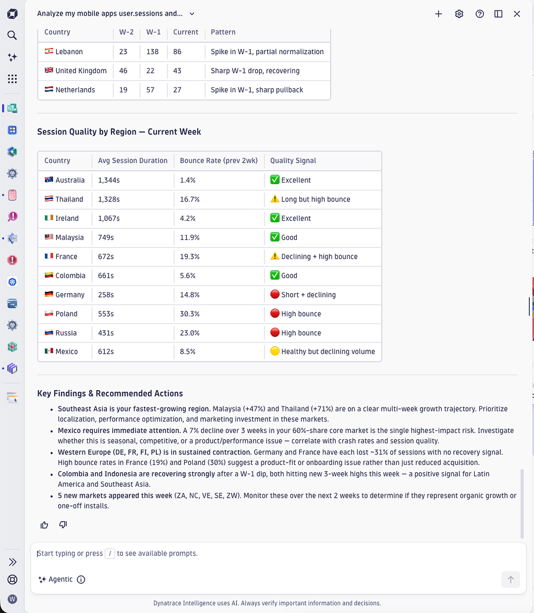

# Your Android Users, Decoded - How Agentic AI Reads Between the Taps

- **Source:** https://medium.com/dynatrace-engineering/your-android-users-decoded-how-agentic-ai-reads-between-the-taps-3f793904f009
- **Published:** 2026-07-14
- **Tags:** agentic-ai, android, dynatrace, dynatrace-intelligence, real-user-monitoring

---

## The Challenge

Quite recently I was confronted with one of those typical Android app publisher questions within my own Android app.

Introducing a new integration dependency within the app demanded to increase the app’s minimum SDK version to 26.

A minimum SDK increase automatically means a more modern base framework, but at the same time it also means that you exclude all users owning mobile devices below that SDK version.

Raising the minimum SDK level can lock out some of your current users from upgrading — and shuts out anyone on a device below SDK 26 as a potential new user.

I find that decision a regular annoyance to weigh the pros and cons of increasing the SDK version.

As I am observing my mobile app with Dynatrace, I can rely on hard facts to take an informed decision about my current user base.

### **What You’ll Learn**

By the end of this post you will know how to:

- Prompt Dynatrace Assist on questions about your mobile app userbase
- Leverage Agentic AI for mobile cohort analysis
- Take informed product decisions, based on Agentic Real User insights

**Prerequisites:** Basic knowledge about Dynatrace Real User Monitoring and Mobile App Observability.

## Fact-driven decision making

Instead of guessing the impact of the change, I am in the lucky position to derive my decision based on observability facts within Dynatrace.
My dashboard shows all the important key performance indicators for my mobile Android application, but it often lacks the information
for answering the spontaneous questions I have.
Of course I could alter my dashboard to also show the current user numbers below and above SDK level 26, but that’s a quite specific question
that I did not put on my regular dashboard.
Don’t get me wrong, I love my dashboard and the information it gives me, as you see a screenshot of it below. It’s just that a dashboard is not the right fit to answer spontaneous, more vivid questions.

*My Dynatrace Custom App Dashboard showing all my important KPIs.*

## Prompt Dynatrace Assist about my Android SDK User Adoption

Now, Dynatrace comes with an out-of-the-box agentic AI interface, called Dynatrace Assist that I challenged with answering my SDK adoption question.

You can see my natural language prompt below:

> “Analyze my mobile apps user.sessions for the last 7 days and tell me how many users I would lose when I increase the minimum SDK version to 26?”

*Dynatrace Assist prompt for SDK adoption analysis*

The result was a positive surprise for me, as it started to understand my userbase, the intended SDK cohorts and it gave me a detailed distribution of my current users. 
It also gave me the detailed information summary of the percentage of users I will lose, as shown below:

*Detailed SDK adoption breakdown from Dynatrace Assist*

I also asked for an exec summary and for a recommendation, which pretty clearly stated that I can safely increase the SDK version as only around 1 percent of my users would be affected by it.

*Executive summary and recommendation from Dynatrace Assist*

## Prompt Dynatrace Assist for predicting mobile app adoption

Now that I know that the introduction of SDK 26 is not an issue at all, I was interested in asking some follow-up questions about
the overall adoption of my app and what to expect in the upcoming months.

> “Analyze my mobile apps user.sessions and give me a prediction for the next week in terms of expected number of users per day. Also highlight the usage pattern over time.”

Dynatrace Assist collected all the data, loaded the [predictive-observability AI skill](https://medium.com/@wolfgangb33r/new-dynatrace-ai-skill-for-predictive-observability-39d1b5cc11f7?sharedUserId=wolfgangb33r) and did run the forecast tool fully automatically.
I got a prediction and analysis of the typical characteristics of my application load along with a nice prediction table of the expected app load for the next week, as it is shown below:

*App load prediction from Dynatrace Assist*

## Dive deeper into the Real User Cohort Analysis

As I was super excited about the prediction result Dynatrace Assist delivered, I wanted to dive deeper by understanding my geographic user adoption and its characteristics. 
I was specifically interested in regions where the adoption is growing versus where it’s declining.

> “Analyze my mobile apps user.sessions and give me a detailed breakdown of the geographic adoption. Highlight where my user base is growing compared to where it’s declining. Compare the current week with the previous 2 weeks of sessions.”

Dynatrace Assist started its deep analysis and the first sentence response was already promising:

*Initial Dynatrace Assist comment on data quality*

After some seconds of fetching data and scoring the novelty of the numbers, Dynatrace Assist came back with an extensive adoption report across the major worldwide regions.
The results again completely surprised me as it not only gave me a detailed explanation of each region’s adoption development but it also showed me the growing countries versus the declining ones.
As a summary Dynatrace Assist gave me some suggestions on how to further support the growing regions and what actions are necessary to counteract the declining countries.

See a glimpse of the report result below:

*AI-generated regional adoption report from Dynatrace Assist*

Along with a convenient summary and recommended next steps for improving the adoption per region.

*Regional adoption report summary from Dynatrace Assist*

## How It Works

Dynatrace Assist is the core agentic operator running within each Dynatrace tenant. It’s your chat window that allows you to interact with the Dynatrace agentic runtime and with the datalakehouse it provides.
Dynatrace Assist automatically loads necessary AI skills filled with expert knowledge about all aspects of observability and it comes with a rich toolbox of deterministic data analysis tools, such as [forecasting](https://medium.com/@wolfgangb33r/new-dynatrace-ai-skill-for-predictive-observability-39d1b5cc11f7?sharedUserId=wolfgangb33r), novelty scoring, [log pattern detection](https://medium.com/dynatrace-engineering/better-logs-smarter-ai-agents-fewer-tokens-87a822fa0c2a?sharedUserId=wolfgangb33r) and anomaly detection.
All that combined — the powerful AI model, the deep agent runtime, the AI Skills, and the necessary deterministic tools — results in the powerful AI agent harness that enables on-demand analysis on top of your own observability data.

## Key Takeaways

The introduction of the new Dynatrace Assist along with its switch to leverage powerful Anthropic LLM models and deep-agent capabilities fully paid off.

Asking questions in natural language to take informed decisions on top of your collected observability data is extremely powerful and saves you hours of handcrafting dashboards and data queries.

Agentic AI along with a powerful data lakehouse is finally paying off by really surfacing the gold that is hidden within all your collected data.

## What’s Next

Go ahead and enable ‘Agentic mode’ for your Dynatrace Assist to gain the full power and flexibility. 
Then try the example prompts above with your own observability data and start experimenting what else it can do for you. 
And don’t worry, we don’t stop here. If you enjoyed this powerful possibility of surfacing product insights and adoption reports dynamically through agentic AI, you will be even more delighted that you soon can automate all those by leveraging Dynatrace agentic workflows.
As the topic of agentic automation with Dynatrace would explode this post, I will keep it for the next update I will write about.

## Resources

- [Dynatrace AI Knowledgebase](https://github.com/Dynatrace/dynatrace-for-ai) — A repository of all the Dynatrace expert knowledge AI skills Dynatrace Assist loads.
- [Dynatrace Assist](https://docs.dynatrace.com/docs/shortlink/assist-conv) — Your natural language chat interface into the Dynatrace datalakehouse.
- [Dynatrace Predictive Intelligence](https://docs.dynatrace.com/docs/shortlink/dynatrace-intelligence-forecast) — Dynatrace prediction AI tool.

---

[Your Android Users, Decoded: How Agentic AI Reads Between the Taps](https://medium.com/dynatrace-engineering/your-android-users-decoded-how-agentic-ai-reads-between-the-taps-3f793904f009) was originally published in [Dynatrace Research and Engineering](https://medium.com/dynatrace-engineering) on Medium, where people are continuing the conversation by highlighting and responding to this story.
