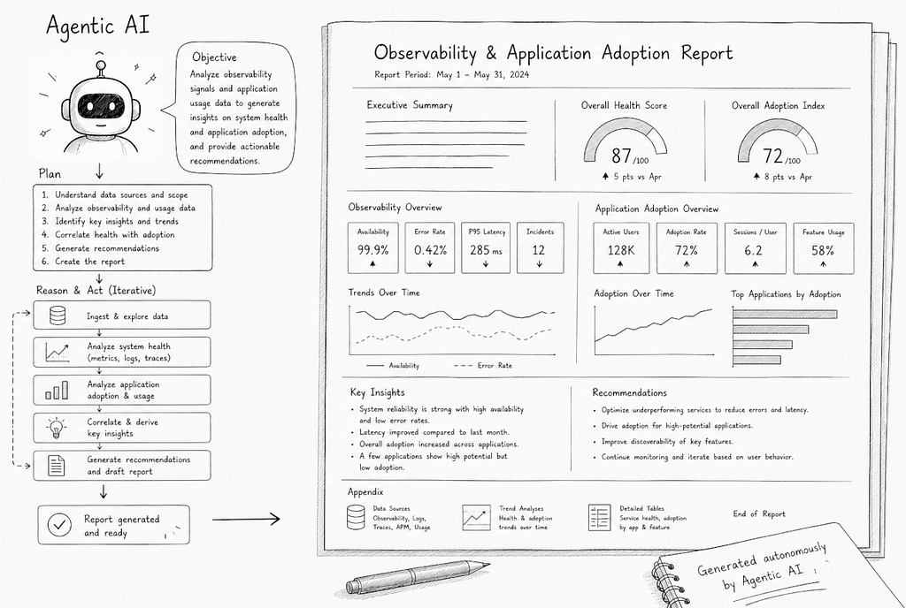
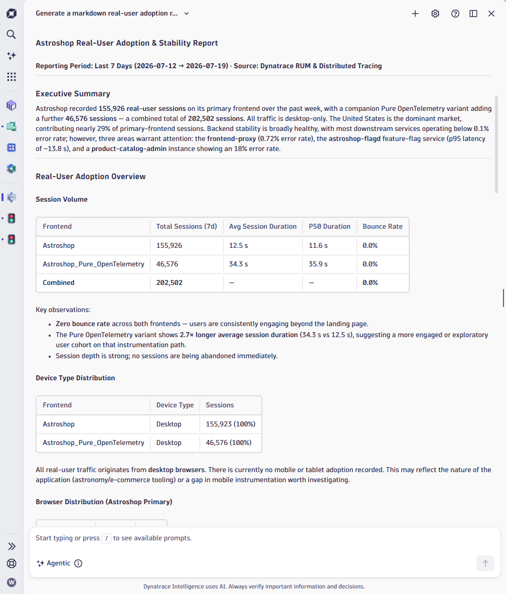
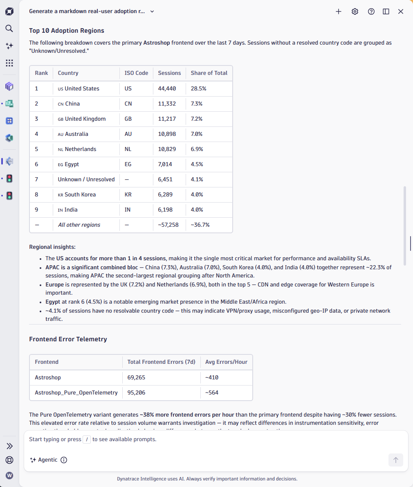
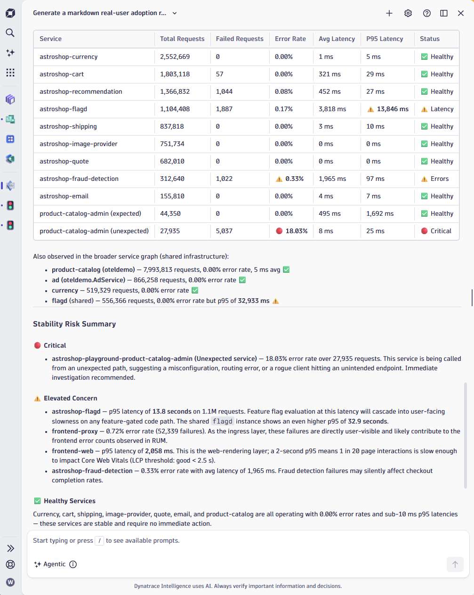
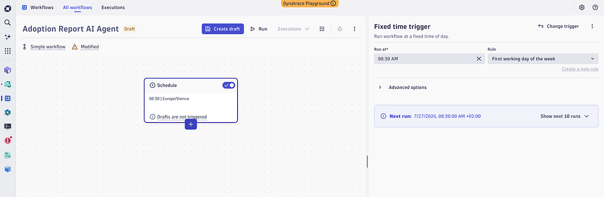
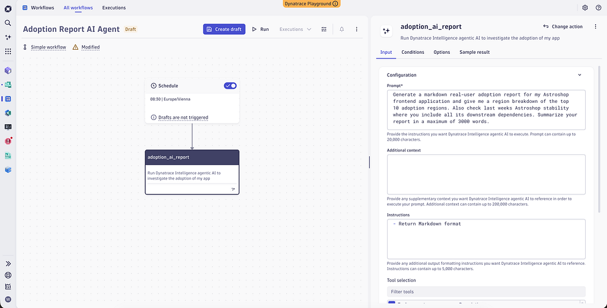
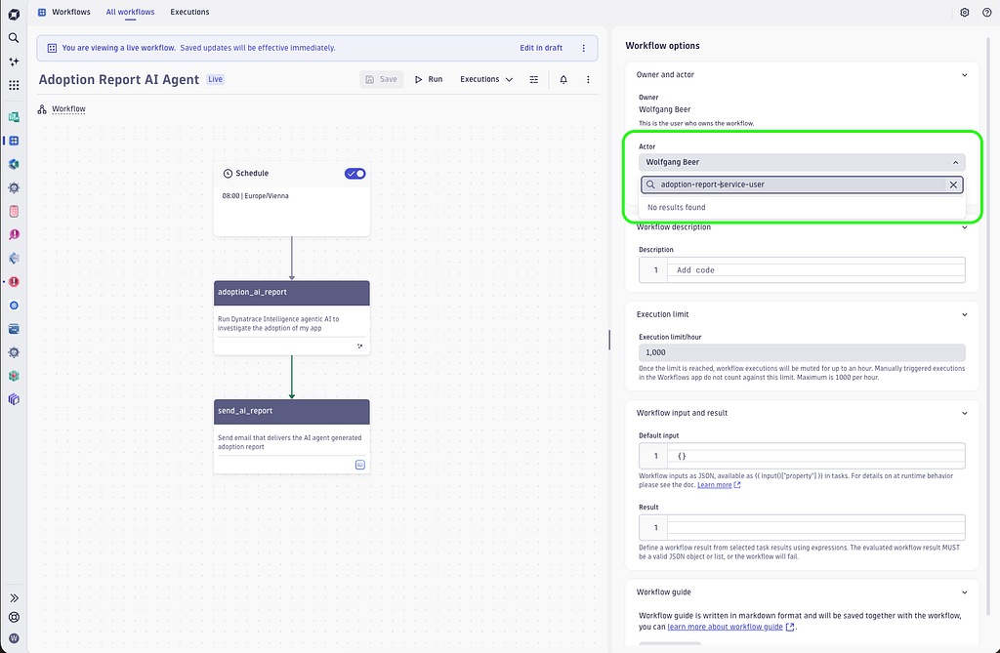
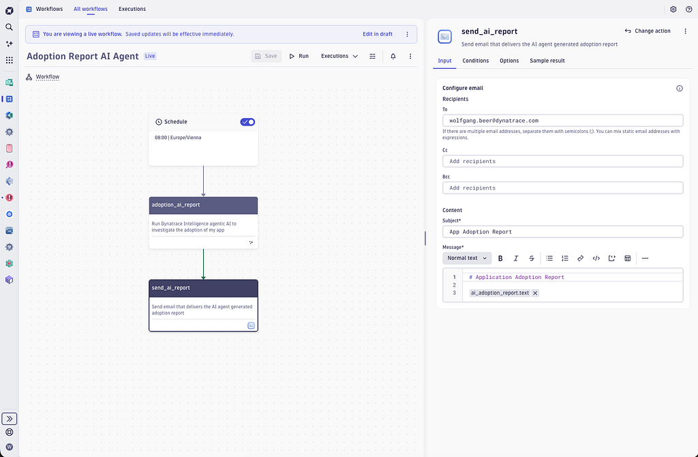
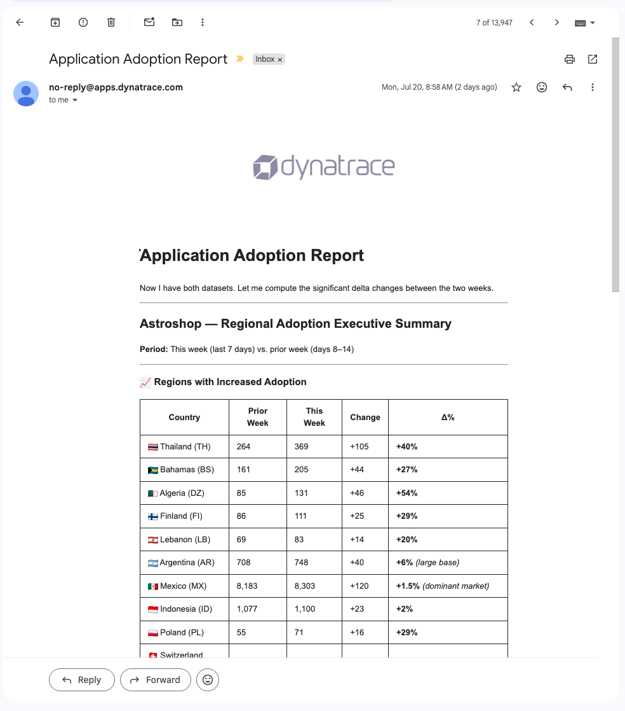

# Agentic Workflows are Killing your Classic Weekly Observability Report

- **Source:** https://medium.com/dynatrace-engineering/agentic-workflows-are-killing-your-classic-weekly-observability-report-d9d1e89928c8
- **Published:** 2026-07-29
- **Tags:** ai-agent, dynatrace-intelligence, llm, observability, reporting

---

*Agentic Workflows — Replacing your classic reports*

## **The Boring Report Problem**

Be honest, nobody ever loved classic weekly reports. The first few you receive might be interesting, but after they keep arriving every week you start to ignore them — and most people roll their eyes the moment reporting is mentioned.

The core problem is their static character: each week’s report is like the one before it, no variability except the values shifting slightly. Classic reports simply cannot catch unknown unknowns or surface anomalies. We expect the SLO report to show all green, and if there were a real issue we would have known about it days earlier anyway.

Now with AI agents becoming a commodity, we must rethink the classic reporting use-case. Within this post I will show that AI agents reinvent classic reporting, and that Agentic Workflows are very likely killing your boring weekly SLO report in the near future.

### **What You’ll Learn**

By the end of this post you will know how to:

- Create your own agentic workflows in Dynatrace
- Generate AI Agent application adoption reports
- Build Agentic Reports for nearly everything

**Prerequisites:** A Dynatrace environment with some defined SLOs or observability data.

## **Context of Classic Reporting**

Classic reporting has a long tradition. It consists of a collection of Key Performance Indicators along with a static report template that defines the report timeframe and the format of the report that is generated.

Popular reporting systems did offer convenient templating engines where the user could visually define the reports template. Microsoft Power BI and the Grafana stack are popular classic reporting systems that companies used to automatically assemble their reports and send them as HTML or PDF.

Those reports are an important part of business operations as they aggregate important information across the different levels in an organization. Those reports range from aggregated SLO reporting towards regular reports about product and feature adoption numbers along with conversion reports for your most critical user journeys.

Besides being of value, those classic reports also showed significant downsides, such as being:

- The need for a domain knowledge user to query and aggregate the necessary data.
- An expert user is needed to shape the visual report.
- A defined report does not adapt to change, therefore the report must be maintained and updated regularly.
- A report is not able to catch unknown-unknowns and surface anomalies.

With the advent of AI agents, a huge opportunity opens for companies to take all the benefits of classic reporting but at the same time eliminating the annoying downsides.

As AI agents are much more flexible in their nature they can easily adapt to newly discovered data situations and they are easy to configure by the use of natural language prompts.

Within the next sections I will show a step-by-step example of configuring an AI agent driven reporting workflow in Dynatrace.

## **Use Dynatrace Assist to shape your report**

The first step towards getting a regular AI agent report is to leverage Dynatrace Assist in agentic mode to work on your reporting prompt.

Within my example, I would like to get a weekly report about my application’s real-user adoption along with some region breakdown that might stand out and that are identified as being abnormal.

You can easily try out my prompt within the Dynatrace Playground:

> “Generate a markdown real-user adoption report for my Astroshop frontend application and give me a region breakdown of the top 10 adoption regions. Also check last week’s Astroshop stability where you include all its downstream dependencies. Summarize your report in a maximum of 3000 words.”

*Dynatrace Assist generated report about Astroshop realuser adoption*

As we asked for it, the AI agent also collects details about all adoption regions and surfaces the top adopting ones. The AI agent also highlights some unknown-unknowns and potentially identifies anomalies within the regional insights paragraph.

*Top adopting real-user regions*

Besides adoption reporting, our two-sentence prompt instruction also makes the AI agent dive deep into Astroshop’s backend dependencies and their health in the reporting period.

See below its report about the individual dependencies along with recommendations.

*Backend dependency health report and recommendations*

Now that we see that our prompt produces an insightful report about our frontend application, **I will bake it into an automated workflow**.

## **Adoption and Health Report as Agentic Workflow**

Workflows allow all kinds of automation, independent of the use of AI agents. Workflow automation ranges from sending email notifications triggered by detected problems over creating ServiceNow incident tickets or mapping ownership.

One question that regularly comes up within my own application is how well I am doing in terms of adoption numbers in different target regions. I would like to get a comprehensive report in terms of how well my Web application did in the last week.

Preferably I would like to get that information on Monday mornings, so that I can follow up on any findings that I need to address.

I can also think of using additional triggers, such as after a marketing campaign was started, I would like to trigger the same AI agent adoption report to confirm whether my money was well spent or not.

Let’s see how easy it is to set up such a regular Agentic AI report within my Dynatrace environment. The first step is to navigate to Workflows app and select a scheduled time trigger that runs our AI agent once a week on Monday mornings.

*Monday morning trigger for my AI agent report run*

Then I select the ‘Prompt Agentic AI’ workflow action that under the hood triggers a multi-step Dynatrace Intelligence agent on top of the LangGraph framework (an open-source library for building stateful, multi-step AI agents) to answer my natural language request prompt.

*Choose your agentic AI prompt*

Within the agentic AI action I can select the tools that I allow my AI agent to select and execute from. I can of course allow it to leverage all of the tools but that might lead to a slow and expensive agent run. In my use-case example I already know that all the adoption agent needs can be fetched with a DQL (Dynatrace Query Language) query, so I only allow it to query data from the Grail data lakehouse (Dynatrace’s unified storage backend) to assemble my adoption report.

One additional important hint here. Typically, you would not run an AI agent with your own user’s credentials. That’s fine for testing and designing your AI agent, but during autonomous operation mode you **should use a service user with reduced permission scope instead**.

This gives the AI agent a **hard permission boundary that it can’t escape** from and you are safe that the agent still runs even if your personal user changes permissions or is disabled for whatever reason.

See below the workflow setting to set your service user as AI agent actor.

*Use an actor service user with limited permission scope for your AI agent*

The last step within your agentic AI adoption report workflow you want to send the markdown report to your email address. Of course, instead of sending emails you can equally well send the report by Slack or do a Git push into your GitHub repo persisting the report. The advantage of Dynatrace workflow is that you have all the options through the ready-made action catalog for you to choose from.

*Use any workflow action, such as send email to further process and send the AI agent generated report*

Once you deployed the agentic workflow you will receive a similar AI generated adoption report with potentially surprising insights, as it is shown in my example report below:

*Example email markdown report*

Download the [Application Adoption Workflow Template from my GitHub repository](https://raw.githubusercontent.com/wolfgangB33r/blogPostMaterial/refs/heads/master/adoption-report-ai-agent.workflow-template.yaml).

## Summary

Within this blog I showed how easy it is nowadays to configure your own AI agent to analyze and process observability data and dynamically generate a report from its findings.

A single natural language prompt is enough to produce a rich, context-aware report that you can trigger on any schedule or occasion.

The flexibility of modern Agentic AI combined with an observability platform like Dynatrace allows any role within your organization to build their own agentic workflows and surface unknown unknowns that a static report would never catch.

Once organizations discover the full power of this approach, I believe it will quickly replace classic reporting — for good reason.

## **Key Takeaways**

- Classic reports provide value but show significant downside in terms of flexibility to adapt to changes.
- Use of AI agents combines the power of reporting with the flexibility of generative, agentic AI.
- Dynatrace agentic workflows are used to generate agentic reports that surface unknown-unknowns and can detect anomalies.

## **What’s Next**

Enable agentic AI within your own Dynatrace observability environment and start generating your first agentic report today. Pick a ready-made template from the [Agentic Workflow Template Catalog](https://docs.dynatrace.com/docs/shortlink/agentic-workflows), or run the adoption prompt from this post directly in the [Dynatrace Playground](https://www.dynatrace.com/signup/playground) to see results within minutes.

## **Resources**

- [Dynatrace agentic and generative AI ](https://docs.dynatrace.com/docs/shortlink/davis-copilot)— Dynatrace Intelligence agentic and generative AI takes your prompt and translates it to DQL, and is capable of auto-executing generated DQL queries.
- [Dynatrace Agentic Workflows](https://docs.dynatrace.com/docs/shortlink/generative-ai-workflow-action) — An agentic workflow is a Dynatrace workflow that uses at least one Dynatrace Intelligence action to fulfill its purpose.
- [Agentic Workflow Template Catalog](https://docs.dynatrace.com/docs/shortlink/agentic-workflows) — A use-case catalog of ready-made agentic workflow templates.

---

[Agentic Workflows are Killing your Classic Weekly Observability Report](https://medium.com/dynatrace-engineering/agentic-workflows-are-killing-your-classic-weekly-observability-report-d9d1e89928c8) was originally published in [Dynatrace Research and Engineering](https://medium.com/dynatrace-engineering) on Medium, where people are continuing the conversation by highlighting and responding to this story.
